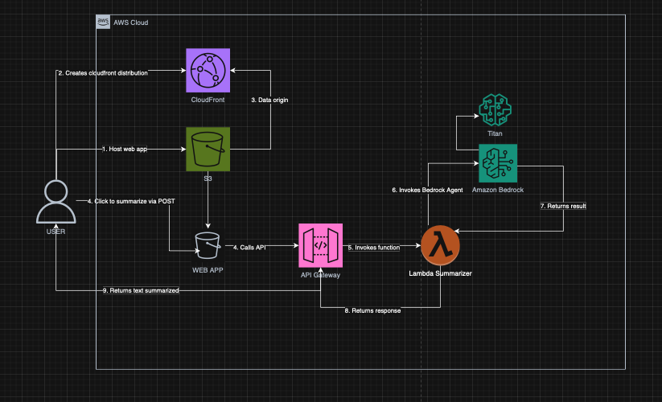

# 📄 AI Text Summarizer Serverless

Un sistema para resumir texto que utiliza inteligencia artificial. Emplea una arquitectura sin servidor en AWS para procesar texto y proporcionar resúmenes.



## 🚀 Características

*   **Resumen Inteligente:** Genera resúmenes concisos.
*   **Procesamiento Asíncrono:** Gestiona solicitudes a través de API REST.
*   **Arquitectura On-Demand:** Paga solo por el uso.
*   **Seguridad de API:** Utiliza variables de entorno para las claves de IA en AWS.

---

## 🛠️ Tech Stack & Servicios AWS

| Servicio                | Función                                     |
| ----------------------- | ------------------------------------------- |
| **Amazon S3**           | Aloja el frontend estático (HTML/CSS/JS)    |
| **Amazon API Gateway**  | Recibe los datos del frontend              |
| **AWS Lambda**          | Lógica de negocio en Python y orquestación. |
| **Amazon Bedrock**      | Motor de IA (Modelo Titan Text Express).    |
| **Boto3**               | SDK de AWS para comunicación interna.       |

---

## 📂 Arquitectura de la Lambda

El proyecto usa una función Lambda que conecta la interfaz de usuario con el modelo de lenguaje:

### 🧠 Lambda AI\_Processor

*   **Disparador:** API Gateway (Solicitud POST con cuerpo JSON)
*   **Role IAM:** Permisos `bedrock:InvokeModel`.
*   **Responsabilidades:**
    *   Extrae el texto enviado por el usuario.
    *   Configura los parámetros y consulta Amazon Bedrock.
    *   Formatea la salida de la IA.

----

## 🧪 Cómo Configurar Paso a Paso

### **Prerrequisitos:**

*   Cuenta de AWS con acceso a la región `us-east-1`.
*   Clave de API o acceso a modelos en Amazon Bedrock.

## 1. Amazon Bedrock

*   Ve a la consola de **Amazon Bedrock**.
*   En **Model Access**, solicita acceso al modelo de su preferencia.
*   Verifica que el estado cambie a **Access Granted**.

## 2. AWS Lambda

*   Crea una función con **Python 3.14**.
*   **Configuración General:** Cambia el **Timeout** a 1 minuto 30 segundos.
*   **Variables de Entorno:** Configura las credenciales necesarias.
*   **Permisos:** Agrega la política `AmazonBedrockFullAccess` al **Execution Role**.

## 3. API Gateway

*   Crea una **API REST**.
*   Crea un recurso llamado `/summarizer` y un método **POST**.
*   Activa la casilla "Use Lambda Proxy integration".
*   Habilita **CORS**.
*   Despliega en la etapa `prod` y copia la **Invoke URL**.

## 4. S3 Frontend

*   Crea un bucket S3 y habilita **Static Website Hosting**.
*   Sube `index.html` (el <script></script> ya está incluido).
*   **IMPORTANTE**: Actualiza la constante del `fetch` con la URL obtenida en API Gateway en script.

## 5. Política de Acceso S3

Configura la siguiente política para que tu web sea pública:

```json
{
    "Version": "2012-10-17",
    "Statement": [
        {
            "Sid": "PublicReadGetObject",
            "Effect": "Allow",
            "Principal": "*",
            "Action": "s3:GetObject",
            "Resource": "arn:aws:s3:::<NOMBRE_DE_TU_BUCKET>/*"
        }
    ]
}
```

## 👨‍💻 Autor
Gerardo HG


