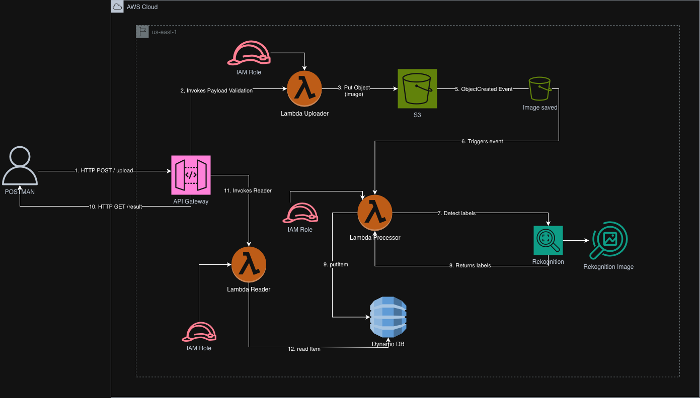
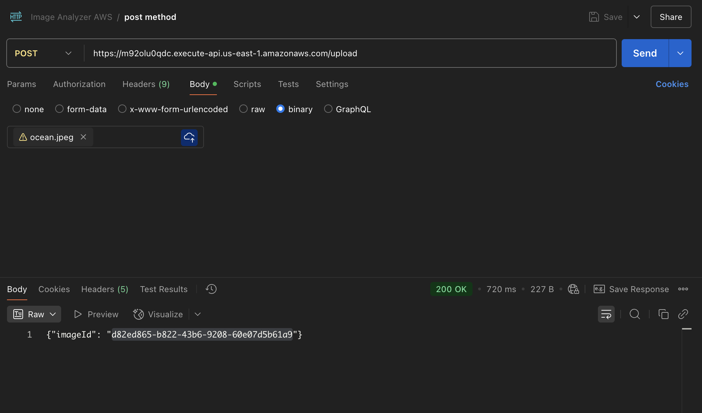
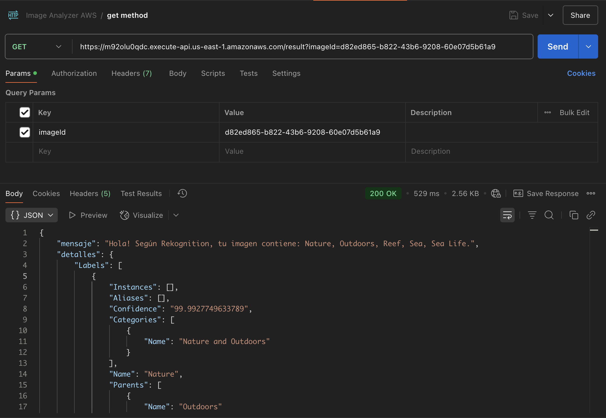

# 📸 AWS Serverless Image Analyzer

Un sistema de análisis de imágenes totalmente **Serverless** construido en AWS. Este proyecto permite subir imágenes a través de una API REST, procesarlas automáticamente con Inteligencia Artificial (Amazon Rekognition) para detectar objetos y etiquetas, y almacenar los resultados para su consulta posterior.





## 🚀 Características
- **Arquitectura 100% Serverless:** No hay servidores que administrar. Escala automáticamente a cero (costo cero cuando no se usa).
- **Procesamiento Asíncrono:** La subida es inmediata, mientras que el procesamiento pesado ocurre en segundo plano.
- **Inteligencia Artificial:** Utiliza Amazon Rekognition para etiquetado profundo de imágenes.
- Configuración manual vía Consola AWS.

---

## 🛠️ Tech Stack & Servicios AWS

| Servicio | Icono | Función |
| :--- | :---: | :--- |
| **API Gateway** | 🌐 | Punto de entrada REST (POST y GET). Maneja tráfico y tipos binarios. |
| **AWS Lambda** | ⚡ | Lógica de negocio (Python 3.x). Ejecuta el código sin servidores. |
| **Amazon S3** | 🪣 | Almacenamiento seguro y escalable de las imágenes (Object Storage). |
| **Amazon Rekognition** | 👁️ | Servicio de visión por computadora para detectar etiquetas (Perro, Gato, Auto, etc.). |
| **Amazon DynamoDB** | 💾 | Base de datos NoSQL para guardar los resultados del análisis (JSON). |
| **CloudWatch** | 📊 | Monitoreo y Logs de la aplicación. |

---

## 📂 Arquitectura de las Lambdas

El proyecto consta de 3 funciones Lambda principales que orquestan el flujo de datos:

### 1. 📤 Lambda Uploader (`upload-function`)
**Disparador:** API Gateway (POST)
**Responsabilidad:**
- Recibe la imagen en formato binario o Base64 desde el cliente (ideal para formato .png y .jpg).
- Decodifica la imagen y genera un UUID único.
- Sube la imagen al Bucket S3 <BUCKET_NAME>.
- Retorna el `imageId` al usuario inmediatamente.

### 2. 🧠 Lambda Processor (`process-function`)
**Disparador:** Evento S3 (ObjectCreated)
**Responsabilidad:**
- Se activa automáticamente cuando un archivo nuevo llega a S3.
- Envía la imagen a **Amazon Rekognition**.
- Recibe las etiquetas detectadas (Labels) y el nivel de confianza (Confidence).
- Guarda el resultado JSON en **DynamoDB**.

### 3. 🔍 Lambda Reader (`read-function`)
**Disparador:** API Gateway (GET)
**Responsabilidad:**
- Recibe una solicitud con el parámetro `?imageId=...`.
- Busca en **DynamoDB** por esa clave primaria.
- Devuelve el análisis completo (etiquetas) al cliente.

---

## 🧪 Cómo Probar (Guía Postman)

### Paso 1: Subir una Imagen (POST)
Sube una imagen para iniciar el proceso.
- **Método:** `POST`
- **URL:** `https://tu-api-id.execute-api.us-east-1.amazonaws.com/dev/upload`
- **Body:** Binary (Selecciona tu archivo .jpg/.png)



### Paso 2: Obtener Resultados (GET)
Usa el `imageId` que recibiste en el paso anterior.
- **Método:** `GET`
- **URL:** `https://tu-api-id.execute-api.us-east-1.amazonaws.com/dev/result?imageId=TU-UUID-AQUI`

**Respuesta Esperada:**
```json
{
    "imageId": "b0ba16fb-e49d-45e5-a752-c0e2643c0369",
    "imageName": "b0ba16fb-e49d-45e5-a752-c0e2643c0369.jpg",
    "Labels": [
        { "Name": "Dog", "Confidence": 99.8 },
        { "Name": "Pet", "Confidence": 98.5 },
        { "Name": "Animal", "Confidence": 95.0 }
    ],
    "timestamp": "2023-10-27T10:00:00"
}
```



