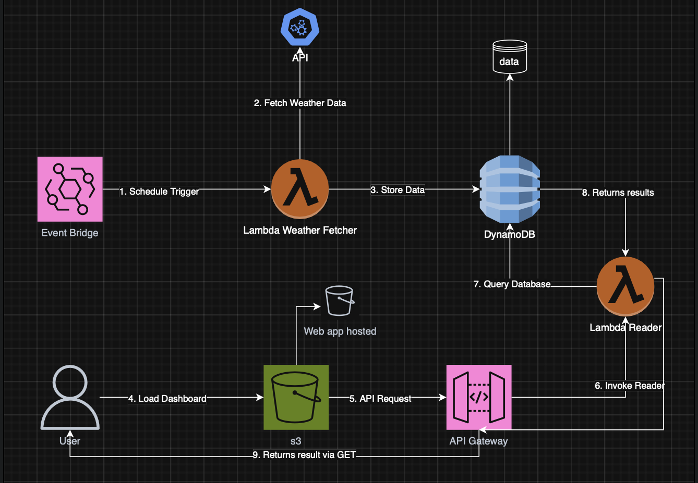

# 🌤️ Real-Time Weather Dashboard

Un sistema que utiliza un Dashboard climático en **tiempo real** construido con arquitectura **serverless en AWS** que obtiene
los datos automáticos de OpenWeatherMaph cada 30 minutos, los almacena en DynamoDB y los visualiza en un frontend estático alojado
alojado en S3.

## 🚀 Características

- **Totalmente automático** - Sin intervención manual  
- **Serverless** - Sin servidores que administrar  
- **Tiempo real** - Datos actualizados cada 30 minutos  
- **Dashboard responsive** - Funciona en móvil y desktop

---

## 🛠️ Tech Stack & Servicios AWS

| Servicio | Función |
|----------|---------|
| **Amazon EventBridge** | Trigger programado cada 30 minutos |
| **AWS Lambda** | Lógica de negocio (Fetcher y Reader) |
| **Amazon DynamoDB** | Almacenamiento NoSQL de datos climáticos |
| **Amazon API Gateway** | Endpoint REST para el frontend |
| **Amazon S3** | Hosting del dashboard web estático |

---

## 📂 Arquitectura de las Lambdas

El proyecto consta de 2 funciones Lambda principales que orquestan el flujo de datos:

### 1. 📤 Lambda Fetcher
**Disparador:** Event Bridge (cada 30 minutos)

**Role IAM:** Acceso a CloudWatchLogsFullAccess y DynamoDBPutItem

**Responsabiidades:**
- Obtiene el clima a través del API de OpeanWeather para la ciudad de Lima y lo guarda en DynamoDB

### 2. 📤 Lambda Reader
**Disparador:** API Gateway (GET)

**Role IAM:** Acceso a CloudWatchLogsFullAccess y DynamoDBReadOnlyAccess

**Responsabilidades:**
- Lee el último registro de DynamoDB y devuelve el resultado a través del GET Request.

----

## 🧪 Cómo Configurar Paso a Paso

### **Prerequisitos:**
- Cuenta de AWS (IAM User)
- API Key Gratuita de **OpenWeatherMap***

## 1. DynamoDB

- Crear una tabla 'WeatherData' o <TABLE_NAME>
- Establecer **Partition Key** -> city (string) y **Sort Key** -> timestamp(string)

## 2. Crear La Funcion Lambda Fetcher

- Crear función con Python
- Agregar variable de entorno para la api key: OPEN_WEATHER_KEY
- Asignar los roles de permisos

  
## 3. EventBridge

- Crear una regla programada (30 minutos)
- Destino a **Lambda Fetcher**

## 4. Lambda Reader

- Crear funcion con Python
- Asignar los roles de permisos

## 5. API Gateway

- Crear una API REST
- Establecer como Recurso : **/weather**
- Seleccionar el método GET integrado con **Lambda Reader**
- Habilitar CORS
- Desplegar API en etapa **'prod'**

## 6. S3 Frontend

- Crear un bucket S3 en la misma región que los servicios de AWS creados (<BUCKET_NAME>).
- Habilitar hosting web estático al bucket
- Configurar la siguiente política de bucket pública:

  {
      "Version": "2012-10-17",
      "Statement": [
          {
              "Sid": "PublicReadGetObject",
              "Effect": "Allow",
              "Principal": "*",
              "Action": "s3:GetObject",
              "Resource": "arn:aws:s3:::<YOUR_BUCKET_NAME>*"
          }
      ]
  }

- Subir la aplicacion 'index.html'

---

---

## 🛠️ Mejoras Futuras

- Autenticación con Cognito
- Soporte para múltiples ciudades
- Gráficos históricos con Chart.js
- Alertas por email (SNS) cuando temperatura supere umbral

## 👨‍💻 Autor
Gerardo HG

