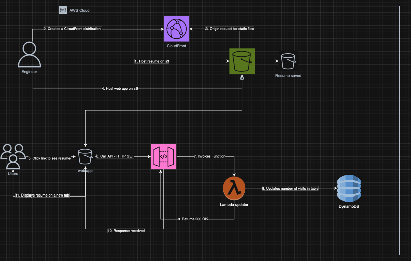

# 📄 Serverless Resume Viewer & Visitor Counter

Un sistema de visualización de CV con un contador de visitas global en tiempo real. Utiliza una arquitectura serverless en AWS 
que incrementa y recupera estadísticas de interacción desde una base de datos NoSQL, servido a través de una 
interfaz web estática.




## 🚀 Características

- **Acceso Directo** - Visualización instantánea del CV en una nueva pestaña.
- **Doble Modo de API** - Capacidad de lectura (GET) e incremento selectivo mediante parámetros de consulta.
- **Serverless** - Escalabilidad total sin administración de servidores.
- **CORS Habilitado** - Comunicación segura entre el frontend y los servicios de AWS.

---


## 🛠️ Tech Stack & Servicios AWS

| Servicio | Función |
|----------|---------|
| **Amazon S3** | Hosting del frontend estático (index.html) |
| **Amazon CloudFront** | CDN para la entrega de archivos y el PDF del CV |
| **Amazon API Gateway** | Endpoint REST con Integración Proxy de Lambda |
| **AWS Lambda** | Lógica de negocio en Python (Lectura/Escritura) |
| **Amazon DynamoDB** | Almacenamiento NoSQL para el contador global |

---


## 📂 Arquitectura de la Lambda

El proyecto utiliza una única función Lambda inteligente que procesa las solicitudes según el contexto del evento:

### 📤 Lambda Reader
**Disparador:** API Gateway (Solicitud GET al endpoint)

**Role IAM:** Permisos de `dynamodb:GetItem` y `dynamodb:UpdateItem` sobre la tabla de visitas.

**Responsabilidades:**
- **Modo Lectura:** Si recibe el parámetro `?type=get`, recupera el valor actual de `visits` sin aumentarlo.
- **Modo Escritura:** Si no hay parámetros (llamada por defecto al ver CV), utiliza una expresión atómica `ADD` para incrementar el contador y devolver el nuevo valor.

----


## 🧪 Cómo Configurar Paso a Paso

### **Prerrequisitos:**
- Cuenta de AWS (IAM User) con permisos para Lambda, CloudWatchLogs y DynamoDB.
- Archivo CV en formato PDF subido a S3.

## 1. DynamoDB
- Crear una tabla llamada `Visits` (o el nombre que prefieras).
- Establecer **Partition Key** -> `id` (String).
- Insertar un item inicial manual: `{"id": "global_counter", "visits": 0}`.

## 2. AWS Lambda
- Crear función con **Python 3.x**.
- Configurar una Variable de Entorno: `TABLE_NAME` con el nombre de tu tabla DynamoDB.
- Asignar permisos en el **Execution Role** para permitir lectura y escritura en la tabla creada.

## 3. API Gateway
- Crear una **API REST**.
- Crear un método **GET**.
- **IMPORTANTE:** Activar la casilla "Usar la integración de proxy de Lambda".
- Habilitar **CORS** (Access-Control-Allow-Origin: '*').
- Desplegar la API en una etapa llamada `'prod'`.

## 4. S3 Frontend
- Crear un bucket S3 y habilitar **Static Website Hosting**.
- Subir el archivo `index.html` (asegúrate de actualizar la constante `API_URL` con tu endpoint de API Gateway).
- Configurar la siguiente política de bucket pública:

```json
{
    "Version": "2012-10-17",
    "Statement": [
        {
            "Sid": "PublicReadGetObject",
            "Effect": "Allow",
            "Principal": "*",
            "Action": "s3:GetObject",
            "Resource": "arn:aws:s3:::<TU_BUCKET_NAME>/*"
        }
    ]
}
```

---


## 🛠️ Mejoras Futuras

- Geolocalización: Ratrear desde qué ciudades visitan el CV usando la IP del evento.
- Gráficos de Interacción: Visualizar las visitas por día usando Chart.js
- Notificaciones SNS: Recibir un correo cada vez que el contador llegue a un hito (ejemplo: cada 100 vistas)


## 👨‍💻 Autor
Gerardo HG


