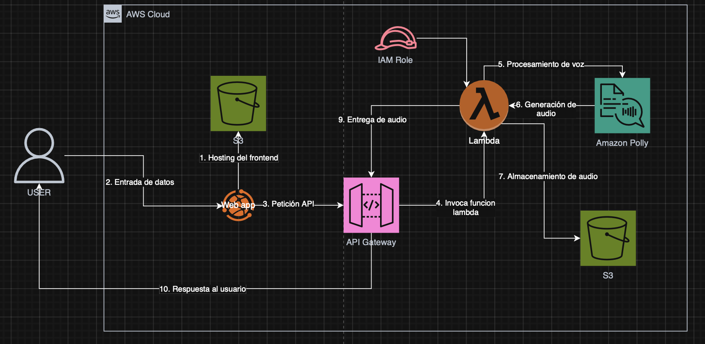

# 🎙️ Text Narrator With Polly

Un sistema de conversión de texto a voz (Text-to-Speech) que utiliza inteligencia artificial. Emplea una arquitectura sin servidor (Serverless) en AWS para procesar texto y proporcionar archivos de audio narrados.



## 🚀 Características

* **Narración Natural:** Convierte texto plano en audio fluido utilizando voces neuronales.
* **Almacenamiento Persistente:** Guarda los archivos de audio generados en la nube para acceso futuro.
* **Arquitectura On-Demand:** Escalabilidad total y pago por uso sin gestionar servidores.
* **Interfaz Moderna:** Frontend optimizado y responsivo para una experiencia de usuario fluida.

---

## 🛠️ Tech Stack & Servicios AWS

| Servicio                | Función                                     |
| ----------------------- | ------------------------------------------- |
| **Amazon S3** | Aloja el frontend estático y almacena los archivos `.mp3`. |
| **Amazon API Gateway** | Punto de entrada REST para recibir el texto del usuario. |
| **AWS Lambda** | Lógica de negocio (Python/Node.js) y orquestación de servicios. |
| **Amazon Polly** | Motor de IA para síntesis de voz avanzada.  |
| **Boto3 / SDK** | SDK de AWS para comunicación entre servicios. |

---

## 📂 Arquitectura de la Lambda

El proyecto utiliza una función Lambda central que actúa como el "cerebro" del sistema:

### 🧠 Lambda Voice_Processor

* **Disparador:** API Gateway (Solicitud POST con cuerpo JSON).
* **Role IAM:** Permisos `polly:SynthesizeSpeech` y `s3:PutObject`.
* **Responsabilidades:**
    * Extraer el texto enviado desde el frontend.
    * Llamar a **Amazon Polly** para generar el flujo de audio.
    * Guardar el archivo generado en el bucket de **S3 Storage**.
    * Generar y retornar la URL del archivo para su reproducción.

----

## 🧪 Cómo Configurar Paso a Paso

### **Prerrequisitos:**

* Cuenta de AWS activa.
* Conocimientos básicos en la consola de AWS.

## 1. Amazon S3 (Almacenamiento y Hosting)

* Crea dos buckets (o uno con carpetas separadas):
    * **Frontend-Bucket**: Habilita **Static Website Hosting**.
    * **Storage-Bucket**: Donde se guardarán los audios generados.
* Asegúrate de configurar los permisos de lectura pública para el bucket de audios.

## 2. AWS Lambda

* Crea una función Lambda (Python 3.x).
* **Configuración:** Aumenta el **Timeout** a 30 segundos para dar tiempo a la síntesis de voz.
* **Permisos:** Agrega una política al rol de ejecución que permita `s3:PutObject` en tu bucket de storage y `polly:SynthesizeSpeech`.

## 3. API Gateway

* Crea una **API REST**.
* Crea un método **POST**.
* Activa la integración **Lambda Proxy**.
* **IMPORTANTE**: Habilita **CORS** para permitir peticiones desde el dominio de tu S3.
* Despliega la API y copia la **Invoke URL**.

## 4. Frontend e Integración

* Actualiza tu archivo `index.html` con la **Invoke URL** de API Gateway en la función `fetch`.
* Sube los archivos al bucket de hosting.

## 5. Política de Acceso S3 (Public Read)

Configura la política de bucket para que los audios sean accesibles desde el navegador:

```json
{
    "Version": "2012-10-17",
    "Statement": [
        {
            "Sid": "PublicReadGetObject",
            "Effect": "Allow",
            "Principal": "*",
            "Action": "s3:GetObject",
            "Resource": "arn:aws:s3:::<NOMBRE_DE_TU_BUCKET_AUDIOS>/*"
        }
    ]
}

```

## 👨‍💻 Autor
Gerardo HG
